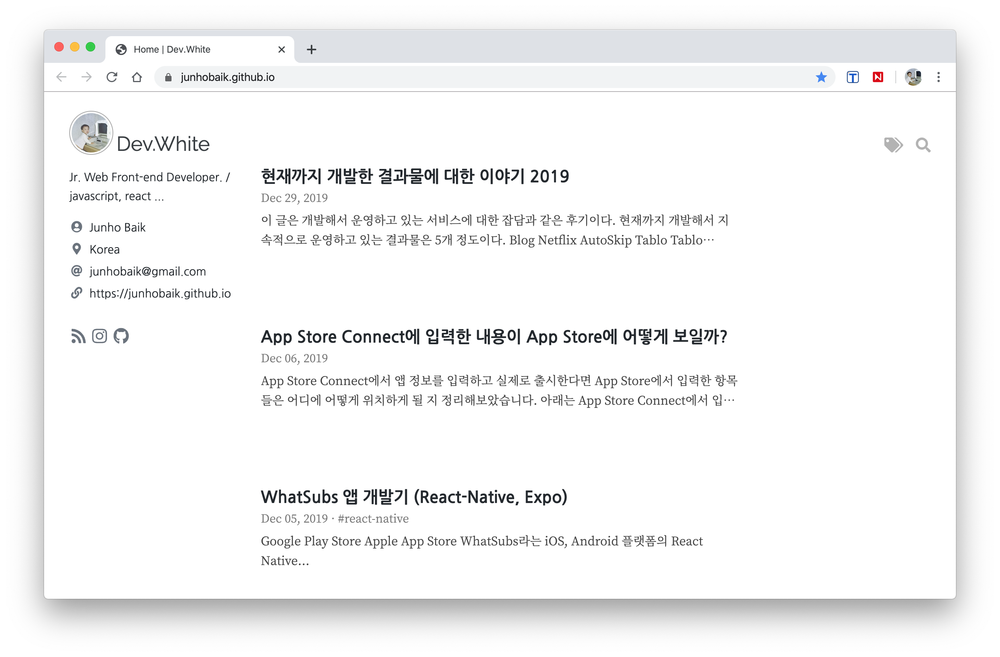
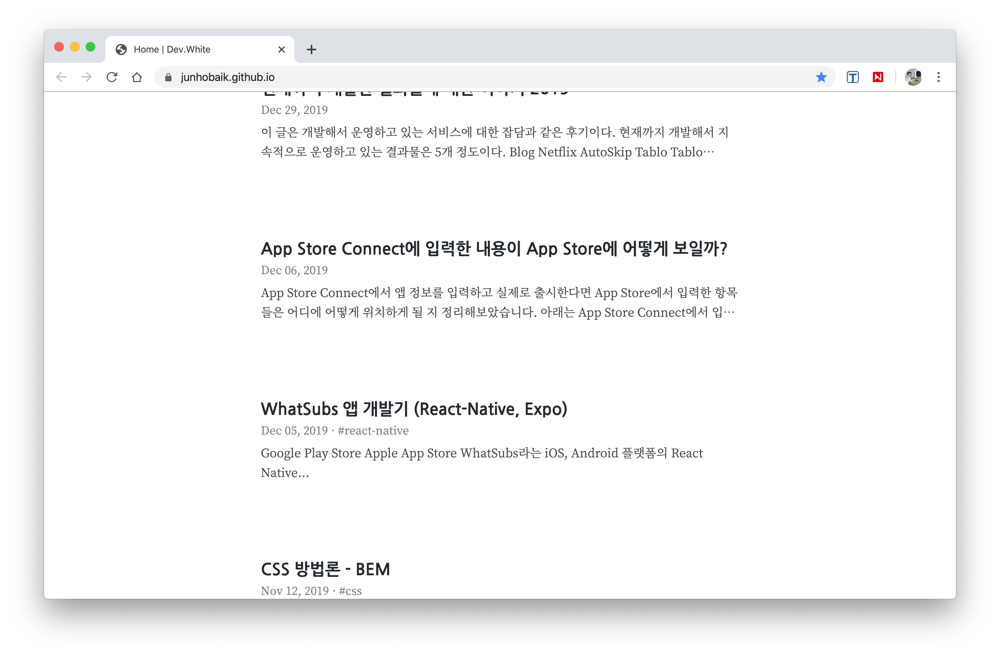
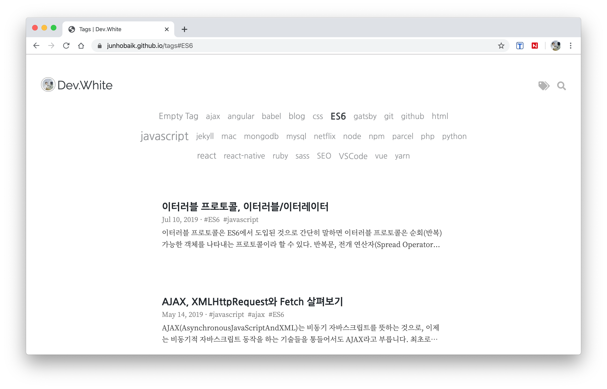
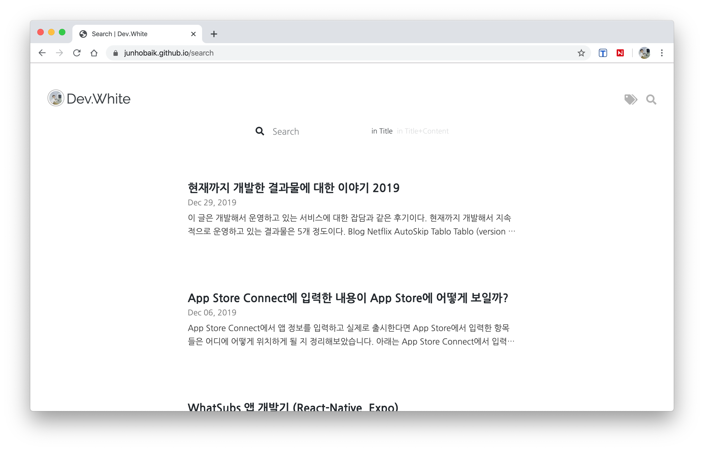

정적 사이트 제작 프레임워크 Gatsby를 이용해 만든 블로그, “Borderless” 테마입니다.

- 심플한 디자인
- 마크다운 지원
- 게시물 태그 기능
- 게시물 검색 기능
- 시리즈 게시물 기능
- Google Analytics
- Google Adsense
- Disqus 댓글 기능
- 검색 엔진 최적화(SEO)

## 화면 설명

### Home 화면

게시물 목록을 볼 수 있는 홈 화면으로,  
타이틀 이미지가 크게 표시되며 프로필 정보가 함께 표시됩니다.  
게시물 목록에는 게시물의 제목, 날짜, 태그, 요약이 표시됩니다.  
프로필 정보에는 소개 문구, 이름, 회사, 위치, 메일, 웹사이트, RSS, 소셜(페이스북, 링크드인, 인스타그램, 깃허브)를 표시할 수 있습니다.  

스크롤 다운시 헤더와 프로필 정보가 숨겨져 게시물 목록에 집중할 수 있습니다.

### Post 화면

게시물 화면입니다.  
헤더는 스크롤 다운시 감춰지며 게시물의 내용에 집중할 수 있습니다.  
화면의 크기가 충분히 넓을 경우 목차가 우측에 표시되며, 그렇지 않을 경우 게시물의 상단에 목차 버튼으로 목차를 볼 수 있습니다.  
목차는 클릭하여 해당 위치로 이동할 수 있고, 스크롤 위치에 따라 보고있는 목차 부분이 강조되어 보고있는 위치를 알 수 있습니다.  

하단에는 광고와 댓글이 위치합니다.

#### 시리즈 게시물

만약 시리즈 게시물이라면 위와 같이 게시물 상단에 시리즈 목록이 표시됩니다.

### 태그 화면

태그 화면에서는 모든 태그가 표시되며,  
게시물 수가 많은 태그는 텍스트 크기가 크게 표시됩니다.  
현재 보고있는 태그는 텍스트가 진하게 표시됩니다.  
아래는 태그에 해당하는 게시물 목록이 표시됩니다.  

### 검색 화면

제목, 제목+내용으로 검색이 가능합니다.  
검색 결과에 따른 게시물 목록이 아래 표시됩니다.

## 그 외 기능

- 간단히 설정 파일의 내용 몇가지만 수정하면 자신의 블로그로 활용할 수 있습니다.
- Google Analytics의 TrackingID를 설정에서 입력하여 쉽게 등록 및 관리할 수 있습니다.
- 자신의 Google Adsense 정보를 설정에서 입력해서 쉽게 구글 애드센스를 활용할 수 있습니다.
- 자신의 Disqus 사이트 생성 후 shortname을 설정에서 입력하면 쉽게 댓글 기능을 활성화 할 수 있습니다.
- 검색 엔진 최적화로 기본 설정만 입력하면 따로 부가적인 작업 없이 구글 검색 결과에 문제 없이 노출될 수 있습니다.
- 웹 표준 준수로 Safari 브라우저 등 읽기 모드(Reader Mode)를 지원합니다.
- 마크다운내에서 이모지, 수학 표기법(ktex)를 지원합니다.
- 임시 게시물(draft)을 작성할 수 있습니다. 개발 환경에서는 표시되며 배포시 표시되지 않습니다.

## Borderless 블로그로 자신의 블로그 시작하기
