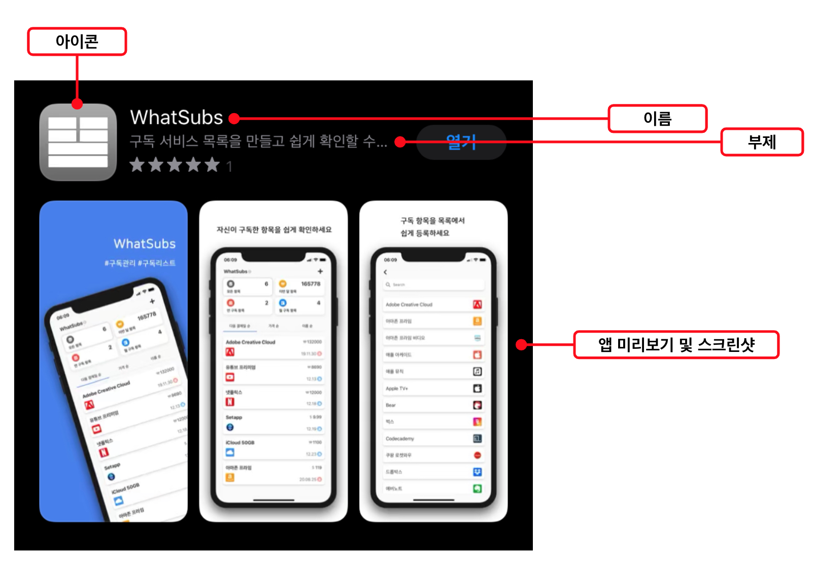
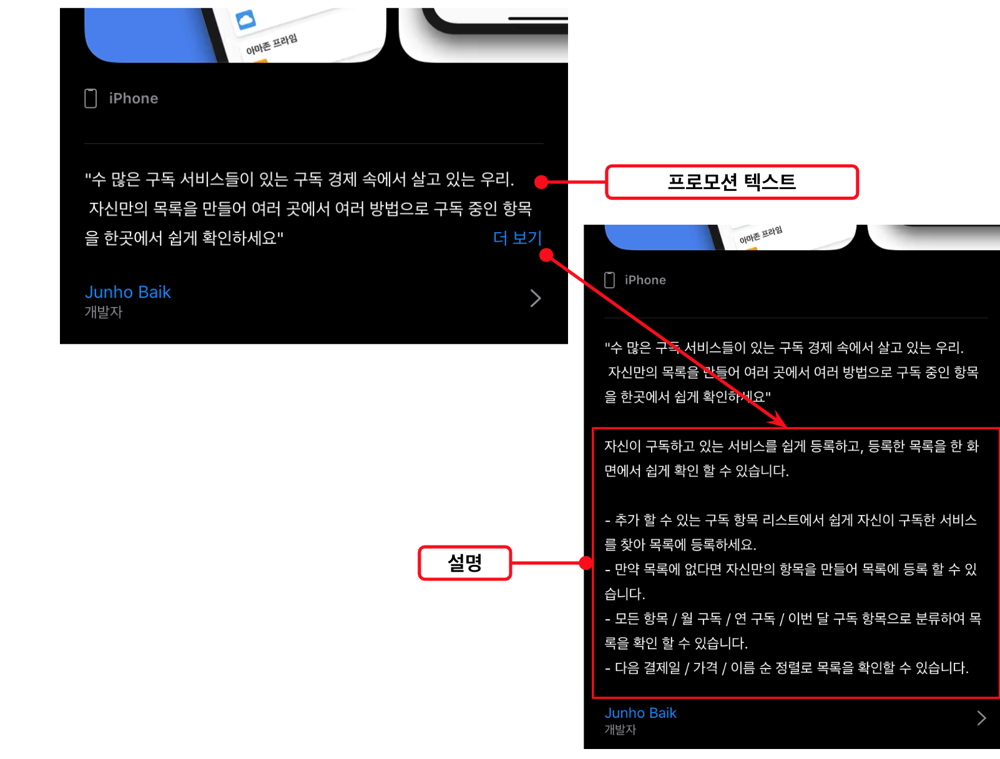

App Store Connect에서 앱 정보를 입력하고 실제로 출시한다면  
App Store에서 입력한 항목들은 어디에 어떻게 위치하게 될 지 정리해보았습니다.

아래는 App Store Connect에서 입력하고  
App Store에 직접적으로 표시될 내용들입니다.
선택항목 및 표시되지 않는 항목은 제외한 목록입니다.

- 이름
- 부제
- 등급
- 앱 미리보기 및 스크린샷
- 프로모션 텍스트
- 설명
- 아이콘
- 카테고리
- 지원 URL
- 저작권
- 개인정보 처리방침 URL

## 검색 결과 화면

앱 스토어 검색을 통해 해당 앱을 찾는다면 검색 결과 목록에서 표시되는 내용은 아래와 같습니다.  
**아이콘**, **이름**, **부제** 그리고 **앱 미리보기 및 스크린샷**이 아래와 같이 나타납니다.

또한 부제의 경우 길이에 따라 줄임표로 내용이 생략될 수 있습니다.
앱 미리보기 및 스크린샷의 경우 앱 미리보기가 우선이며 그 뒤로 스크린샷이 위치합니다.

## 앱 상세 화면

상단에는 위와 같이 **아이콘**, **이름**, **부제**, **등급**, **앱 미리보기 및 스크린샷**이 위치합니다.

스크린샷 아래로는 우선 **프로모션 텍스트**가 위치하며 *더보기*를 누를 경우에 이어서 **설명**이 추가적으로 노출되게 됩니다.

하단에서는 리뷰 부분에 앱 지원을 누르게 되면 입력해둔 **지원 URL**의 주소로 이동합니다.  
**카테고리**는 두개의 카테고리를 입력해두더라도 첫번째 카테고리만 표시되게 됩니다.  
**등급**은 상단 화면의 연령에 이어서 다시 연령 등급이라는 항목으로 표시됩니다.  
**저작권**은 입력해둔 저작권에 앞에 ©가 추가되어 표기됩니다.  
개인정보 처리방침을 누르게 되면 입력한 **개인정보 처리방침 URL**로 이동합니다.

(참고로 정보의 언어는 앱 스토어 커넥트에서 지정한 기본 언어가 나타나는 것이 아닙니다)

## 추가 정보

### 검색에 반영되는 항목

- 이름
- 부제
- 태그
  태그의 경우에는 심사에 영향을 미칠 수 있으니 주의해서 작성해야합니다.

### 개인정보 처리방침 만들기

개인정보 처리방침이 없으면 심사에 올릴 수 없습니다.
[개인정보보호 종합포털](https://www.privacy.go.kr/ '개인정보보호 종합포털')의 개인정보처리방침 만들기 메뉴를 들어가서 절차에 따라 만들 수 있습니다. 절차에 따라 완성된 내용이더라도 추가적인 검토와 수정은 필수입니다.
