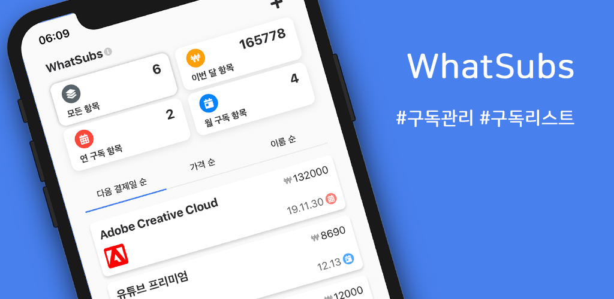

**[Google Play Store](https://play.google.com/store/apps/details?id=com.junhobaik.whatsubs)**  
**[Apple App Store](https://apps.apple.com/kr/app/whatsubs/id1489637056)**

---

WhatSubs라는 iOS, Android 플랫폼의 React Native 앱을 최근에 만들게 되었습니다.
지금은 두 플랫폼에서 모두 심사가 끝나고 출시가 되었습니다.
아무래도 개인적인 필요에 의해 만들기 시작하였고 수요가 많은 앱이 될거라고 생각하진 않지만 이번에는 배포까지 전반적인 과정을 체험해보고자 이렇게 출시하게 되었습니다.

앱을 간단히 소개하면 자신이 구독한 구독 서비스를 등록하고 리스트를 통해 확인할 수 있는 구독 관리에 도움을 주는 앱이라고 할 수 있습니다.

다양한 구독 서비스를 사용하면서 구독 후 사용하지 않는데 깜박하고 해지를 안하거나, 결제 수단이 다양하다보니 각 결제 수단별로 구독한 항목을 확인하는데 어려움을 느껴 만들게 된 앱입니다.

기존에는 웹과 크롬 확장 프로그램을 주로 개발해왔는데 이번에는 제대로 React Native앱을 만들어보고자 리액트 네이티브 문서를 보면서 기초부터 공부하며 만들게 되었습니다. 또 백엔드는 없는 독립형 앱을 만들고자 했습니다.

### 리액트 네이티브

리액트 네이티브를 사용하면서 어려웠던 점이나 느낀 점

- 생각보다 React와 달리 제약이 많다  
   Angular와 Vue보다 React를 선호하는 이유가 좀 더 자유롭다는 것이었습니다. 그런데 React Native는 다양한 플랫폼에서 동작하게 하려는 이유 등으로 이해는 가지만 생각보다 구현 할 방법에 제약이 있었습니다.
- 노치, 펀치홀 대응  
   노치와 펀치홀을 대응하는데 있어 쉽지가 않았습니다. 매끄러운 UI를 대응하기 위해서는 라이브러리 사용이 필요했고, 사용하더라도 완전히 android와 ios를 동시에 편하게 대응하기는 어려웠습니다.
- 해상도 대응?  
   다양한 기기, 다양한 화면비, 다양한 해상도가 있다보니 앱에서 표시되는 컨텐츠 내용의 양이 차이가 생겨 여기에 대응하는 것이 힘들었습니다. 처음에는 화면비로 대응을 했더니 화면비가 높으나 해상도가 낮은 기기로 좀 연식이 있는 기기와 같은 예외가 생겨 다시 해상도를 기준으로 컨텐츠의 크기를 조절해야했습니다. 이 부분에 대해서는 차후에도 디테일한 수정이 필요하다고 생각하고 있습니다.
- Expo  
   이번에는 Expo를 통해 개발하고, 번들링을 하게 되었는데 만약 Expo가 없으면 많이 불편하겠다는 생각을 했습니다. create-react-app 없이 개발할 수 있듯 React-Native도 그럴 수 있게 공부가 더 필요하겠다는 생각했습니다.
- UI / UX  
   RN에만 해당하는 것은 아니지만 모바일 앱으로 개발하면서 더욱 UI에 고민이 많았습니다. 게다가 한 화면에서 모든 정보를 보여주기를 원했기때문에 어떻게 할까 고민을 많이 했습니다. 지금의 화면에 만족하고는 있지만 본인이 화면비가 긴타입의 핸드폰을 사용하고 있고 본인을 기준으로 개발하다보니 저해상도의 예전 폰들에서는 내용이 덜 표시되는 문제는 뒤늦게 알게 되어 컨텐츠의 크기 등을 조절했지만 완전 만족스럽지는 못합니다.

### 앱 출시

앱 출시를 하면서 느낀 점

- 저작권, 라이선스  
   항상 개발을 하면서 저작권을 중요하게 생각했습니다. 다양한 회사와 서비스의 로고가 들어가다보니 저작권에는 문제가 없는지 알아보게 되었고, 알아보면서 다시 한번 저작권은 어렵다는 생각을 또 한번 했습니다. 그리고 이번에는 앱 출시에 있어서 앱 내부에 ‘오픈소스 라이선스’라는 것을 넣어서 앱 내에서 사용한 패키지, 라이브러리에 대한 라이선스 내용을 첨부했습니다.
- 영어 공부를 해야겠다?  
   개발하는데 있어 라이브러리 등등 도큐먼트에 가서 사용법을 익히는 정도는 괜찮았지만 출시에 있어 가이드 문서를 보는건 역시 힘들었습니다. 어서 영어 공부를 더 해야겠다는 생각이 들었습니다... 또한 다국어 처리를 하는데 있어서도 번역기로는 한계가 있었고 전에 만든 Tablo 웹앱은 다국어 처리를 했으나 일단은 이 WhatSubs앱은 한국을 대상으로 출시했고 차후에 다국어 처리가 가능하도록 개발을 진행했으니 나중에 몇가지만 더 구현하고 내용을 채우면 될 것 같습니다.
- 개인정보  
   앱스토어에서는 개인정보처리방침을 마련하지 않으면 앱을 올리지 못합니다. 일상 그냥 넘기던 그 긴 문서를 직접 만들어야한다니 막막했는데 개인정보처리방침을 쉽게 만들 수 있게 된 공공사이트가 있어 만들 수 있었습니다. 허나 지금 앱은 독립형앱이고 서버가 없어 따로 수집하는 개인정보가 없기 때문에 이렇게 쉬웠던 것이지 만약에 개인정보를 수집하는 앱이라면 더 알아봐야 할 것이 많고 작성하는데도 어려울뿐더러 개인정보처리방침을 따라 개인정보 처리를 하고 폐기를 하고 관리를 해야한다면 앱을 운영하는 것이 그리 쉽지만은 않겠다는 생각이 들었습니다.

---

- 아이폰의 왼쪽 사이드를 슬라이드하여 뒤로가기, 안드로이드폰의 뒤로가기 버튼(하드웨어, 소프트웨어)의 기능과 그에 따른 화면의 스택, 그리고 노치 영역을 고려한 View인 SafeAreaView를 사용하기 위해 사용한 모듈은 `react-native-gesture-handler`

- 개인정보처리방침을 만들때 이용한 사이트는 [개인정보보호 종합포털](https://www.privacy.go.kr/ '개인정보보호 종합포털')이며 ‘개인정보처리방침 만들기’ 메뉴를 이용하면 된다.
