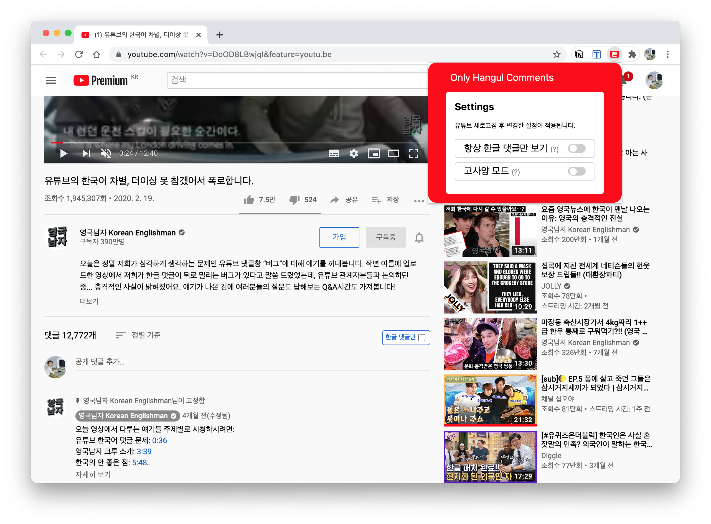

**유튜브 영상에서 한글 댓글만을 볼 수 있는 크롬 확장 프로그램 "한댓"**  
쉽게 댓글 화면의 우측 상단에 위치한 버튼으로 한글 댓글만 보기를 활성화할 수 있습니다.

[유튜브의 한국어 차별, 더이상 못 참겠어서 폭로합니다. by 영국남자](https://youtu.be/DoOD8LBwjqI) 영상을 보고 간단하게 만들어봤습니다.

### 🇰🇷 ["한댓: 유튜브 한글 댓글만 보기" **다운로드 (크롬 웹 스토어 바로가기)**](https://chrome.google.com/webstore/detail/%ED%95%9C%EB%8C%93-%EC%9C%A0%ED%8A%9C%EB%B8%8C-%ED%95%9C%EA%B8%80-%EB%8C%93%EA%B8%80%EB%A7%8C-%EB%B3%B4%EA%B8%B0/ljbjgmahddhnccggldafiaemkgacmmld?hl=ko)

---

- 댓글창의 우측 상단에 위치한 "한국어 댓글만" 체크박스를 체크하면 한글 댓글만 보여지게 됩니다.
- 확장 프로그램 아이콘을 클릭하여 '항상 활성화', '고사양 모드' 설정을 활성/비활성 할 수 있습니다.
  - 고사양 모드와 일반 모드의 차이
  - 일반 모드: 외국어 댓글이 잠깐 노출된 후 바로 사라집니다.
- 고사양 모드: 외국어 댓글이 전혀 노출되지 않습니다.
- 한글 댓글의 기준은 댓글의 시작과 끝의 각 여섯 글자 안에 한글이 있어야 합니다.
