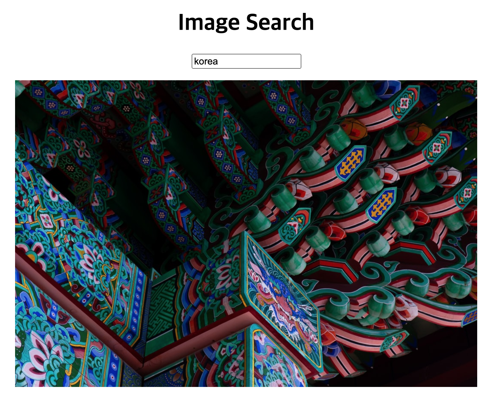
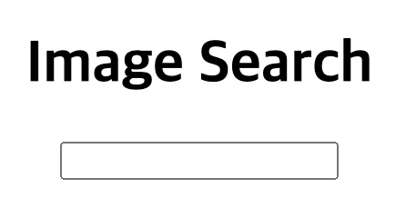

자바스크립트만을 사용해 React와 비슷하게 Component를 구현해보는 것이 오늘의 목표입니다.

기본적인 최신 JS와 React에 대한 이해가 있다는 것을 가정으로 기술되었습니다.

구현 할 것은 검색 시 해당 키워드에 해당하는 랜덤한 이미지를 하나 보여주는 간단한 앱입니다.



---

## 기본적인 폴더 구조와 베이스 코드



### 폴더 구조

- src/
    - components/
    - App.js
    - style.css
- index.html

`~/index.html`

```html
<!DOCTYPE html>
<html lang="en">
  <head>
    <meta charset="UTF-8" />
    <meta name="viewport" content="width=device-width, initial-scale=1.0" />
    <title>Image Search</title>
		<link rel="stylesheet" href="./src/style.css" />
  </head>
  <body>
    <main>
      <header>
        <h1>Image Search</h1>
        <input class="keyword" autocomplete="off" />
      </header>
      <div class="search-results"></div>
			<script type="module" src="./src/App.js"></script>
    </main>
  </body>
</html>
```

`~/src/style.css`

```css
main {
  text-align: center;
}

div.search-results {
  margin-top: 1rem;
}

img.result-image {
  width: 80vw;
}
```

`~/src/App.js`

```jsx
const keywordElement = document.querySelector(".keyword");

keywordElement.addEventListener("keyup", (evt) => {
	const { key } = evt;

  if (key === "Enter") {}
});
```

`index.html`의 경우, 두가지 부분만 보시면 됩니다. `input.keyword`와 `div.search-results`입니다.
`input.keyword`의 동작을 기준으로 App에서 `div.search-results`가 컴포넌트로 분리될 것입니다.  

`App.js`의 경우, 기본적으로 검색의 동작을 구현하기 위해 `input.keyword` 엘리먼트에 keyup 이벤트리스너를 추가했고, enter 동작에 unsplash가 제공하는 무료 Simple API를 이용해 키워드에 해당하는 랜덤한 이미지의 주소를 가져오는 것까지 구현되었습니다.

## 컴포넌트 구현

`~/src/component/SearchResults.js`

```jsx
class SearchResult {
  constructor() {}

	async render() {
    const { keyword } = this.state;
    const element = document.querySelector(".search-results");

    if (keyword) {
      const imageURL = (await fetch(`https://source.unsplash.com/featured/?${keyword}`)).url;
      element.innerHTML = ``
    } else {
      element.innerHTML = `<p>검색어를 입력하세요</p>`;
    }
  }
}

export default SearchResult;
```

기본적인 컴포넌트의 코드는 위와 같습니다.

검색어인 `keyword` 를 전달받았다면 이미지를 렌더하고, 없다면 검색어를 입력하라는 문구를 렌더합니다.

render 함수를 통해 렌더링이 이루어지므로, App.js에서 render 함수를 불러 첫 렌더링을 하면 됩니다.

`~/src/App.js`

```jsx
import SearchResults from "./components/SearchResults.js";

const SearchResultInstance = new SearchResults();

const keywordElement = document.querySelector(".keyword");

keywordElement.addEventListener("keyup", (evt) => {
	const { key } = evt;

  if (key === "Enter") {}
});

SearchResultInstance.render();
```

SearchResults 컴포넌트를 import 하였고,SearchResultInstance로 SearchResult의 instanse를 만들고 마지막에 render 함수를 실행하여 첫 렌더링이 이루어졌습니다.


이제 다음으로 구현할 것은 실제로 App에서 값을 전달 받아, 받을 때마다 새로운 결과를 보여줘야합니다.

기본적으로 React를 생각해보면 컴포넌트는 state를 가지고 있고 state가 변경될 때마다 render가 실행됩니다.

따라서 이 컴포넌트도 **state를 가지고, state가 변경 될 때마다 render가 실행**되도록 변경해봅시다.

`~/src/component/SearchResults.js`

```jsx
class SearchResult {
  constructor() {
    this.state = {
      keyword: "",
    };
  }

  setState(nextState) {
    this.state = nextState;
    this.render();
  }

	...
```

위와 같이 state를 만들었고, setState가 호출 될 때마다 state를 새로운 값으로 바꾸고 render가 실행됩니다.

`~/src/App.js`

```jsx
...

keywordElement.addEventListener("keyup", (evt) => {
  const { value } = evt.target;
  const { key } = evt;

  if (key === "Enter") {
    SearchResultInstance.setState({ keyword: value });
  }
});

...
```

이제 `App.js` 에서 `SearchResultInstance.setState({ keyword: value });` 를 통해 enter로 검색마다 검색 키워드를 `SearchResultInstance`의 `setState`로 전달함으로 SearchResults 컴포넌트가 새로 렌더링 되며 결과가 바뀌게 됩니다.


## 컴포넌트 개선

### 컴포넌트 상속

이 프로젝트에서는 하나의 컴포넌트(SearchResults)만 만들어 사용하고 있지만 다수의 컴포넌트를 사용한다면,

컴포넌트의 기능을 하는 컴포넌트 클래스를 하나 만들어 상속받아 사용하는 것으로 공통적으로 사용되는 중복을 개선할 수 있습니다.

`~/src/component/Component.js`

```jsx
export default class Component {
  constructor(props = {}) {
    this.state = this.state ?? {};
    this.render = this.render ?? function () {};

    if (props?.element) {
      this.element = props.element;
    }
  }

  setState(nextState) {
    const prevState = this.state;

    this.state = {
      ...prevState,
      ...nextState,
    };

    this.render();
  }
}
```

이제 element는 props으로 전달받을 것이며, 
setState는 따로 구현하지 않아도 상속받아 사용이 가능 할 것입니다.

`~/src/component/SearchResults.js`

```jsx
import Component from "./Component.js";

class SearchResult extends Component {
  constructor(props) {
    super(props);
    this.state = {
      keyword: "",
    };
  }

  async render() {
    const { element, state } = this;
    const { keyword } = state;

		...
```

이제 생성자의 super로 부모의 생성자를 호출하고, `render()` 에서 이제 `element` 를 this에서 가져온다.

`~/src/App.js`

```jsx
...

const SearchResultInstance = new SearchResults({
  element: document.querySelector(".search-results"),
}

...
```

`App.js` 에서는 인스턴스 생성시 element를 넘겨준다.

## 최종 코드

`~/index.html`

```html
<!DOCTYPE html>
<html lang="en">
  <head>
    <meta charset="UTF-8" />
    <meta name="viewport" content="width=device-width, initial-scale=1.0" />
    <title>Image Search</title>
    <link rel="stylesheet" href="./src/style.css" />
  </head>
  <body>
    <main>
      <header>
        <h1>Image Search</h1>
        <input class="keyword" autocomplete="off" />
      </header>
      <div class="search-results"></div>
    </main>
    <script type="module" src="./src/App.js"></script>
  </body>
</html>
```

`~/src/style.css`

```css
main {
  text-align: center;
}

div.search-results {
  margin-top: 1rem;
}

img.result-image {
  width: 80vw;
}
```

`~/src/App.js`

```jsx
import SearchResults from "./components/SearchResults.js";

const SearchResultInstance = new SearchResults({
  element: document.querySelector(".search-results"),
});

const keywordElement = document.querySelector(".keyword");

keywordElement.addEventListener("keyup", (evt) => {
  const { value } = evt.target;
  const { key } = evt;

  if (key === "Enter") {
    SearchResultInstance.setState({ keyword: value });
  }
});

SearchResultInstance.render();
```

`~/src/components/Component.js`

```jsx
export default class Component {
  constructor(props = {}) {
    this.state = this.state ?? {};
    this.render = this.render ?? function () {};

    if (props?.element) {
      this.element = props.element;
    }
  }

  setState(nextState) {
    const prevState = this.state;

    this.state = {
      ...prevState,
      ...nextState,
    };

    this.render();
  }
}
```

`~/src/components/SearchReults.js`

```jsx
import Component from "./Component.js";

class SearchResult extends Component {
  constructor(props) {
    super(props);
    this.state = {
      keyword: "",
    };
  }

  async render() {
    const { element, state } = this;
    const { keyword } = state;

    if (keyword) {
      const imageURL = (await fetch(`https://source.unsplash.com/featured/?${keyword}`)).url;
      element.innerHTML = ``;
    } else {
      element.innerHTML = `<p>검색어를 입력하세요</p>`;
    }
  }
}

export default SearchResult;
```