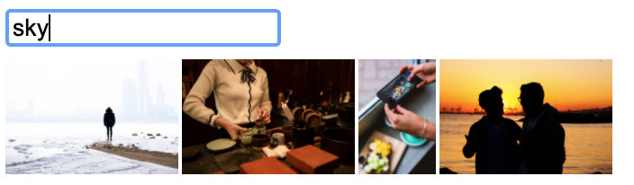
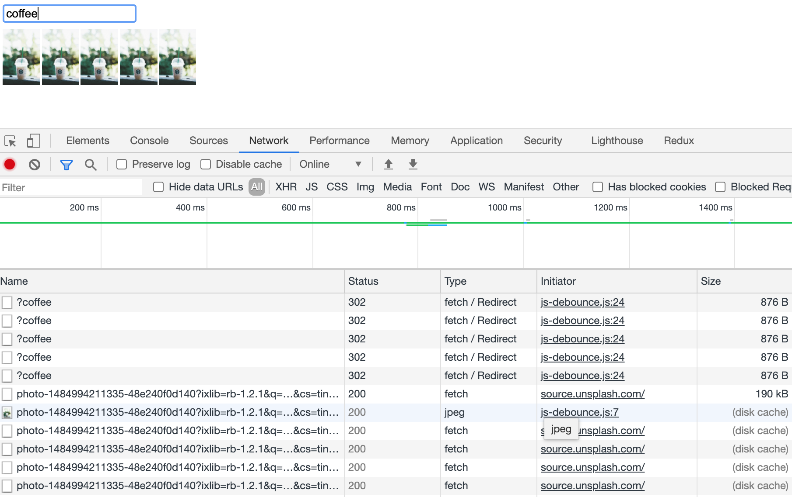
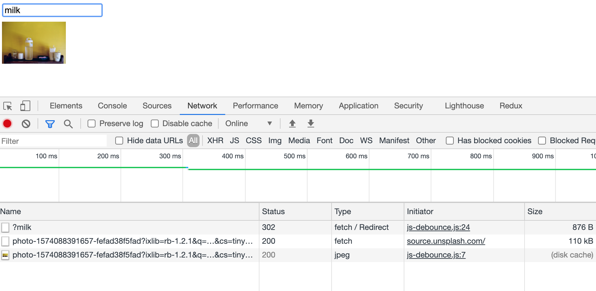

## **Debounce?**

디바운스란 과도한 연속적인 요청을 방지하기 위해 사용합니다.
연속된 요청 중 마지막 요청만을 실행합니다. (또는 첫번째 요청만)

예를 들어 검색창에 타이핑을 할때마다 추천 검색어를 불러오는 API를 사용한다면, 빠르게 타이핑되는 자음모음마다 API가 호출될 테고 요청으로 받는 응답은 즉각적이지 않을 것인데, 따라서 호출을 통해 쓰이는 응답 결과는 얼마되지 않게 된다. 이렇게 낭비되는 API 호출은 유료 API의 경우 비용적인 문제로 치명적일 수 있다.

---

만들게 될 결과물은 Unsplash의 무료 이미지 API를 이용할 것입니다.

한번의 검색에 하나의 이미지가 추가됩니다.
(아래의 결과는 4번의 검색이 이루어져 4개의 이미지가 존재하는 것)

빠르게 연속적인 검색 시 마지막 하나의 요청만 이루어져 하나의 이미지만 나오도록 하는 것이 목표입니다.



아래는 Debounce가 적용되기 전의 코드로 여기서 수정을 할 것입니다.

`index.html`

```html
<!DOCTYPE html>
<html lang="en">
  <head>
    <meta charset="UTF-8" />
    <meta name="viewport" content="width=device-width, initial-scale=1.0" />
    <title>Debounce</title>
    <style>
      .keyword {
        margin-bottom: 0.5em;
      }
      .image {
        height: 4em;
        margin-right: 2px;
      }
    </style>
  </head>
  <body>
    <input class="keyword" type="text" autocomplete="false" />
    <div class="image-wrap"></div>
    <script src="/js-debounce.js"></script>
  </body>
</html>
```

`js-debounce.js`

```jsx
const keywordElement = document.querySelector(".keyword");

const renderImage = (imageURL) => {
  const imgEl = document.createElement("img");
  imgEl.src = imageURL;
  imgEl.className = 'image'

  document.querySelector(".image-wrap").appendChild(imgEl);
};

keywordElement.addEventListener("keyup", (evt) => {
  const { key, target } = evt;
  const { value } = target;

  if (key === "Enter") {
		fetch(`https://source.unsplash.com/featured/?${value}`).then((res) => renderImage(res.url));
  }
});
```

여기에서 실행하여 검색을 해봅시다.
검색어 입력 후 Enter를 빠르게 5번 입력한다면, 사진이 5개 추가되는 모습을 볼 수 있을겁니다.



이제 debounce를 구현해 봅시다.

```jsx
// js-debounce.js

...

let timer = null;

keywordElement.addEventListener("keyup", (evt) => {
	...

  if (key === "Enter") {
    if (timer) clearTimeout(timer);

    timer = setTimeout(() => {
      fetch(`https://source.unsplash.com/featured/?${value}`).then((res) => renderImage(res.url));
      timer = null;
    }, 500);
  }
});
```

setTimeout의 **동작을 500ms의 지연을 두고 실행되는 요청**이라고 하고
clearTimeout의 동작을 **요청 취소**라고 이해하면 쉽습니다.

500ms의 지연 중에 새로운 요청이 오면 요청 취소 후 다시 지연을 둔 요청이 이루어지는 것입니다.

예로, 빠르게(< 500ms) 두번 Enter를 눌렀다고하면 아래와 같은 동작이 이루어 질 것입니다.

1. [첫번째 요청] timer 값이 없습니다. (대기 중인 timeOut 동작 없음)
2. [첫번째 요청] setTimeout에 해당하는 timer ID가 timer의 값이 되었고 해당 timeOut 동작은 대기 중입니다.
3. [두번째 요청] timer 값이 있습니다. (대기 중인 timeOut 동작 있음)
4. [두번째 요청] timer 값에 해당하는 timer ID를 가진 timeOut 동작을 취소합니다.
5. [두번째 요청] setTimeout에 해당하는 timer ID가 timer의 값이 되었고 해당 timeOut 동작은 대기 중입니다.
6. [두번째 요청] (500ms 후) 대기 중이던 timeOut 동작이 실행됩니다.

debounce를 구현하기 전처럼 빠르게 5번 검색을 실행하면 이제 마지막 요청 하나만 이루어지게 되는 모습을 볼 수 있습니다.



아래 코드는 debounce를 함수로 만들어 사용하는 모습입니다.

```jsx
// js-debounce.js

...

const debounced = (func, wait) => {
  let timerID;
  return (...args) => {
    clearTimeout(timerID);
    timerID = setTimeout(() => func.apply(this, args), wait);
  };
};

keywordElement.addEventListener(
  "keyup",
  debounced((evt) => {
    const { key, target } = evt;
    const { value } = target;

    if (key === "Enter") {
      fetch(`https://source.unsplash.com/featured/?${value}`).then((res) => renderImage(res.url));
    }
  }, 500)
);
```

아래처럼 간단히 lodash의 debounce를 이용할 수도 있습니다.

```jsx
// js-debounce.js

import _ from "lodash";

...

keywordElement.addEventListener(
  "keyup",
  _.debounce((evt) => {
    const { key, target } = evt;
    const { value } = target;

    if (key === "Enter") {
      fetch(`https://source.unsplash.com/featured/?${value}`).then((res) => renderImage(res.url));
    }
  }, 500)
);
```